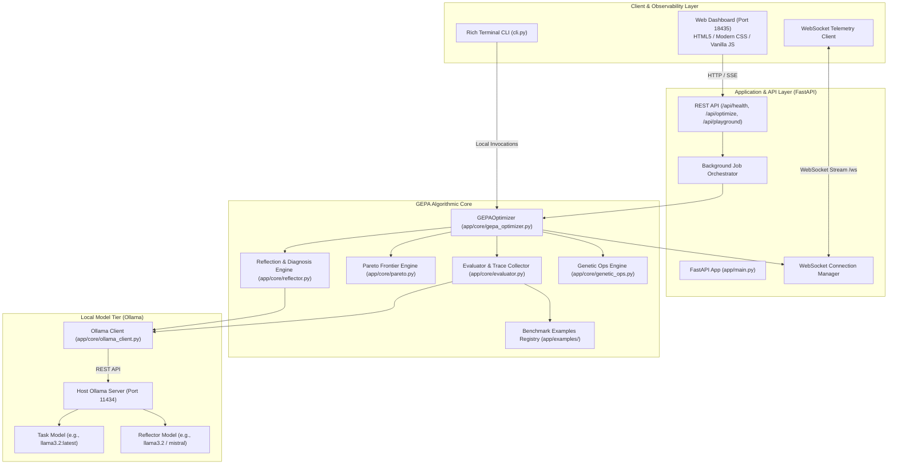
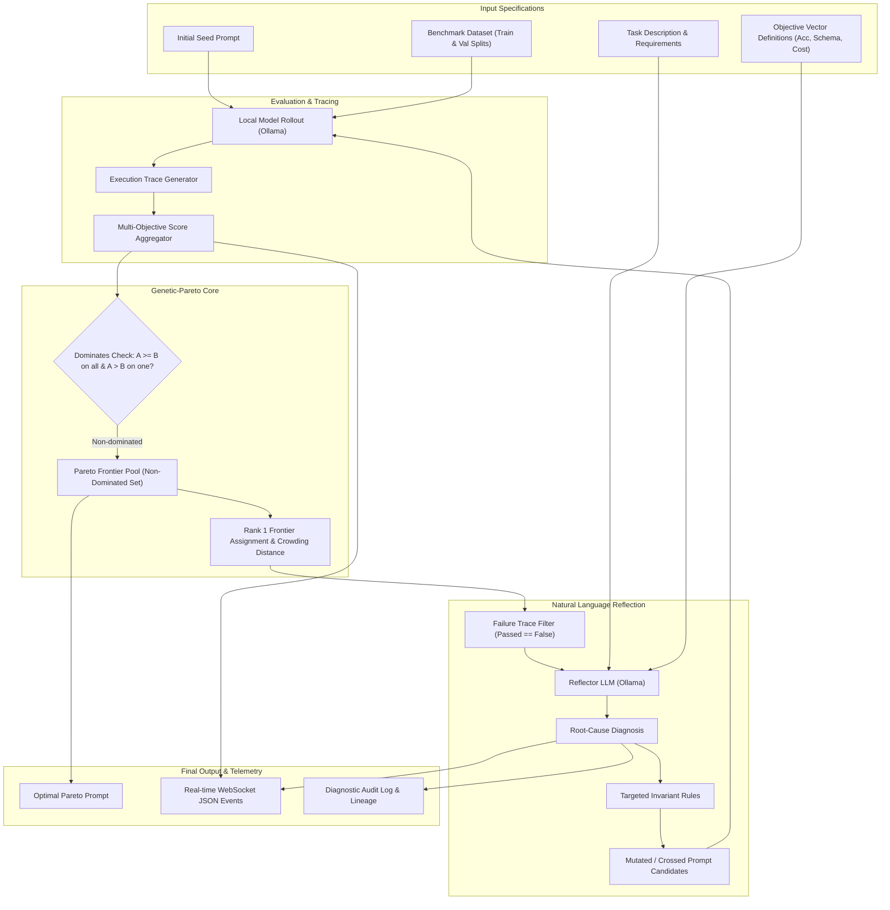

# System Architecture & Technical Specification

## GEPA: Genetic-Pareto Reflective Automatic Prompt Optimizer

This document provides a comprehensive technical reference for the GEPA Prompt Optimization engine, its multi-objective evolutionary loop, LLM reflection mechanisms, and containerized deployment architecture.

---

## 1. High-Level System Architecture (HLSA)

The system consists of four primary tiers:
1. **Presentation & Observability Tier**: Web Dashboard (Port 18435), WebSocket live streaming, Canvas-rendered Pareto frontier, and CLI interface.
2. **API & Orchestration Tier**: FastAPI application managing asynchronous optimization jobs, candidate telemetry, and side-by-side prompt testing.
3. **Core GEPA Algorithmic Tier**: Evaluator & Trace Collector, NSGA-II style Pareto Dominance engine, Reflector Engine, and Genetic Breeding Engine.
4. **Local LLM Execution Tier**: Ollama REST API (`/api/generate`, `/api/tags`) running locally on host machine or bridged through Docker gateway.

---

## 2. End-to-End Sequence Diagram

The following diagram illustrates the complete execution flow from when a user clicks "Start GEPA Optimization" to when the final Pareto-optimal prompt is delivered:

```mermaid
sequenceDiagram
    autonumber
    actor User as User / Web UI
    participant Server as FastAPI Server (Port 18435)
    participant GEPA as GEPA Optimizer Engine
    participant Eval as Evaluator & Traces
    participant Pareto as Pareto Frontier Engine
    participant Reflector as Reflector LLM Engine
    participant Ollama as Local Ollama (llama3.2)

    User->>Server: POST /api/optimize (example, models, hyperparams)
    Server->>GEPA: Initialize Population (Gen 0 Seed + Variations)
    Server-->>User: 200 OK (Optimization Started)

    rect rgb(18, 30, 48)
        note over GEPA, Ollama: Generation 0: Baseline Evaluation
        loop For each Candidate in Gen 0
            GEPA->>Eval: Evaluate Candidate on Training Samples
            loop For each Sample
                Eval->>Ollama: POST /api/generate (System Prompt, Input Text)
                Ollama-->>Eval: Model Output, Latency, Token Count
                Eval->>Eval: Parse JSON, Compute Metrics & Failure Critique
            end
            Eval-->>GEPA: Candidate with Execution Traces & Objective Vector
            GEPA-->>Server: Broadcast Candidate Evaluated Event
        end
        GEPA->>Pareto: Compute Non-Dominated Sort & Crowding Distance
        Pareto-->>GEPA: Pareto Frontier (Rank 1 Candidates)
        GEPA-->>User: Broadcast Gen 0 Snapshot (Frontier & Chart Data)
    end

    rect rgb(28, 22, 45)
        note over GEPA, Ollama: Evolutionary Loop (Gen 1 to G)
        loop Generation 1 to G
            alt Mutation Probability (p_m = 0.7)
                GEPA->>Pareto: Sample Parent from Pareto Frontier
                GEPA->>Reflector: Extract Parent Failure Traces
                Reflector->>Ollama: POST /api/generate (Failure Traces + Task Spec)
                Ollama-->>Reflector: Diagnosis, Strategy, and Mutated Prompt
                Reflector-->>GEPA: Mutated Child Candidate
            else Crossover Probability (p_c = 0.3)
                GEPA->>Pareto: Sample Parent A & Parent B from Frontier
                GEPA->>Reflector: Request Genetic Synthesis
                Reflector->>Ollama: POST /api/generate (Parent A + Parent B)
                Ollama-->>Reflector: Synthesized Hybrid Prompt
                Reflector-->>GEPA: Crossed Child Candidate
            end

            GEPA->>Eval: Evaluate Child Candidates on Benchmark
            Eval->>Ollama: Rollout Inference
            Ollama-->>Eval: Outputs & Timing
            Eval-->>GEPA: Evaluated Child Traces

            GEPA->>Pareto: Update Global Population & Recalculate Frontier
            Pareto-->>GEPA: New Rank 1 Frontier (Dominated Prompts Pruned)
            GEPA-->>User: Broadcast Gen N Snapshot & Reflector Card
        end
    end

    rect rgb(18, 40, 30)
        note over GEPA, User: Final Validation & Delivery
        GEPA->>Eval: Evaluate Best Frontier Candidate on Validation Set
        Eval-->>GEPA: Validation Scores
        GEPA-->>User: Broadcast OPTIMIZATION_FINISHED
        User->>Server: POST /api/playground/test (Side-by-Side Test)
        Server->>Ollama: Rollout Baseline vs Optimized
        Ollama-->>Server: Responses
        Server-->>User: Side-by-Side Diff, Latencies, Schema Checks
    end
```

---

## 3. Data Flow Diagram (DFD)

The data flow highlights how raw failure critiques are transformed into refined prompt instructions without losing schema validity or token efficiency:

---

## 4. Algorithmic Formulation

### 4.1 Pareto Dominance Formulation
Let $C = \{c_1, c_2, \dots, c_m\}$ be candidate prompts. For each candidate $c$, the evaluator computes an objective vector:
$$\mathbf{F}(c) = \left( f_1(c), f_2(c), \dots, f_k(c) \right)$$
where:
- $f_1(c) \in [0, 1]$: Core Task Accuracy / F1
- $f_2(c) \in [0, 1]$: Strict Schema Compliance (JSON validity, key presence)
- $f_3(c) \in [0, 1]$: Token Efficiency ($1.0 - \text{penalty for verbosity}$)

Candidate $c_a$ **Pareto-dominates** candidate $c_b$ ($c_a \succ c_b$) if and only if:
$$\forall i \in \{1, \dots, k\}, \quad f_i(c_a) \ge f_i(c_b) \quad \land \quad \exists j \in \{1, \dots, k\}, \quad f_j(c_a) > f_j(c_b)$$

The **Pareto Frontier** $\mathcal{P}^*$ is the subset of all candidates not dominated by any other candidate:
$$\mathcal{P}^* = \left\lbrace c \in C \;\middle|\; \nexists c' \in C : c' \succ c \right\rbrace$$

### 4.2 Crowding Distance Diversity Metric
To prevent all prompts from converging to a single point along the trade-off curve, GEPA calculates crowding distance $d_i$ for each solution on the frontier:
$$d_i = \sum_{m=1}^{k} \frac{f_m(i+1) - f_m(i-1)}{f_m^{\max} - f_m^{\min}}$$
Candidates with higher crowding distance are prioritized during parent selection, preserving diverse prompt styles (e.g. ultra-compact vs highly-detailed reasoning).

### 4.3 Natural Language Reflection Formulation
Unlike Reinforcement Learning where feedback is a scalar reward $R \in \mathbb{R}$, GEPA constructs a natural language diagnostic context $\mathcal{D}$:
$$\mathcal{D} = \left\lbrace (x_i, y_i, \hat{y}_i, \mathcal{C}_i) \;\middle|\; \text{trace } i \text{ failed} \right\rbrace$$
where:
- $x_i$: input query
- $y_i$: target ground truth
- $\hat{y}_i$: model output
- $\mathcal{C}_i$: specific failure critique

The Reflector LLM evaluates:
$$(\text{Diagnosis}, \text{Strategy}, c_{\text{new}}) \sim P_{\text{reflector}}\left( \cdot \;\middle|\; \mathcal{D}, c_{\text{parent}}, \text{TaskSpec} \right)$$

---

## 5. Structured Internal Log Taxonomy

The system emits typed telemetry events over WebSockets and stdout:

| Event Type | Description | Key Payload Attributes |
| :--- | :--- | :--- |
| `LOG` | Internal execution logs | `level`, `message`, `details` |
| `SAMPLE_EVALUATED` | Single sample rollout | `candidate_id`, `sample_id`, `passed`, `metrics` |
| `REFLECTION_COMPLETED` | Reflector LLM analysis | `generation`, `parent_id`, `diagnosis`, `strategy`, `mutated_prompt` |
| `CROSSOVER_COMPLETED` | Hybrid prompt synthesis | `generation`, `parent_a`, `parent_b`, `rationale`, `crossed_prompt` |
| `GENERATION_SNAPSHOT` | Frontier state snapshot | `generation`, `frontier_count`, `best_scores`, `frontier_candidates` |
| `OPTIMIZATION_FINISHED` | Final run summary | `duration_seconds`, `frontier_size`, `best_candidate`, `initial_candidate` |
