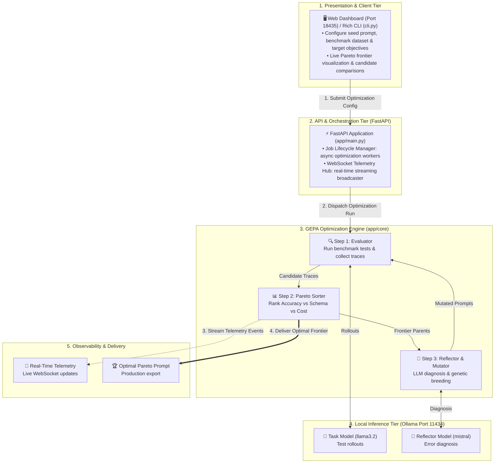
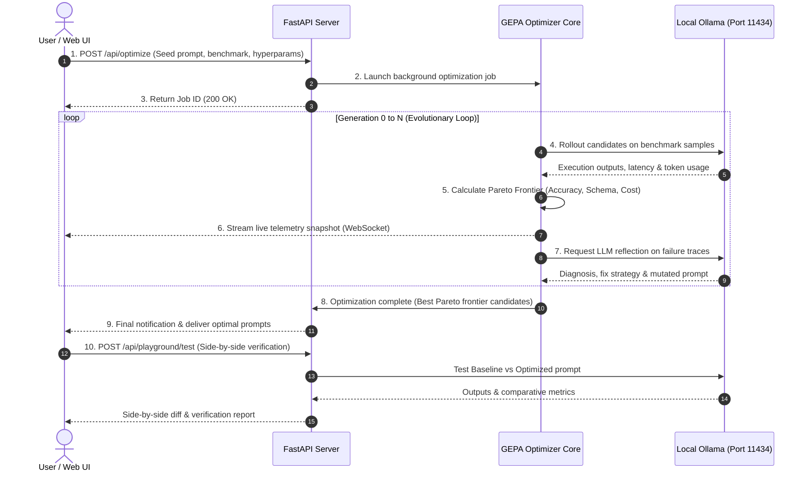
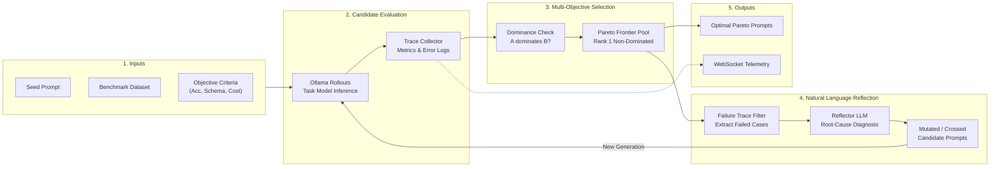

# System Architecture & Technical Specification

## GEPA: Genetic-Pareto Reflective Automatic Prompt Optimizer

This document provides a comprehensive technical reference for the GEPA Prompt Optimization engine, its multi-objective evolutionary loop, LLM reflection mechanisms, and containerized deployment architecture.

---

## 1. High-Level System Architecture & Flow

The GEPA framework is structured into four primary connected tiers, with a dedicated observability and delivery pipeline:

1. **Presentation & Client Tier**: Web Dashboard (Port 18435) and rich terminal CLI (`cli.py`) for configuring optimization targets, monitoring Pareto convergence, and comparing prompts side-by-side.
2. **API & Orchestration Tier**: FastAPI application (`app/main.py`) managing asynchronous background optimization workers and real-time WebSocket telemetry streaming.
3. **Core GEPA Algorithmic Engine**: Evaluator & trace collector (`evaluator.py`), multi-objective Pareto dominance engine (`pareto.py`), and natural language LLM reflector & genetic mutator (`reflector.py`, `genetic_ops.py`).
4. **Local LLM Inference Tier**: Host Ollama instance (Port 11434) running task models (e.g. `llama3.2`) for evaluation rollouts and reflector models (e.g. `mistral`) for failure diagnosis.
5. **Observability & Delivery Tier**: WebSocket event dispatcher delivering live Pareto frontier updates, metric convergence charts, and production-ready optimal prompts.

### High-Level System Connectivity & Evolutionary Flow

### Component Connectivity & Data Flow Summary

| Connection / Link | Source → Target | Protocol / Mechanism | Description |
| :--- | :--- | :--- | :--- |
| **1. Job Submission** | Web UI / CLI → FastAPI | HTTP `POST /api/optimize` | User configures seed prompt, benchmark dataset, and optimization hyper-parameters. |
| **2. Worker Dispatch** | FastAPI → GEPA Core | Async Task Runner | Background thread initializes Population Generation 0 and kicks off the evolutionary loop. |
| **3. Benchmark Rollouts** | Evaluator ↔ Ollama | REST `POST /api/generate` | Local Ollama runs test cases against candidate prompts, recording accuracy, schema validity, and latency. |
| **4. Failure Reflection** | Reflector ↔ Ollama | REST `POST /api/generate` | Reflector LLM diagnoses root-cause error traces and synthesizes targeted instruction fixes. |
| **5. Live Telemetry** | Pareto Sorter → Web UI | WebSocket `/ws` | Streaming events broadcast live frontier coordinates, candidate scores, and diagnostic reflections. |
| **6. Prompt Delivery** | GEPA Core → Web UI | REST / WebSocket / File | Production-ready non-dominated prompt candidate delivered with side-by-side playground testing. |

---

## 2. End-to-End Sequence Diagram

The following sequence diagram illustrates the complete execution flow from when a user clicks "Start GEPA Optimization" to when the final Pareto-optimal prompt is delivered:

---

## 3. Data Flow Diagram (DFD)

The data flow highlights how raw failure critiques are transformed into refined prompt instructions without losing schema validity or token efficiency:

---

## 4. Algorithmic Formulation

### 4.1 Multi-Objective Evaluation & Pareto Dominance

#### 4.1.1 Objective Scorecard Vector
When evaluating a candidate prompt $c \in C$, GEPA computes a multi-dimensional objective vector rather than a single compressed score:
$$\mathbf{F}(c) = \left( f_1(c), f_2(c), \dots, f_k(c) \right)$$
where each dimension represents an independent performance objective:
- $f_1(c) \in [0, 1]$: **Task Accuracy** (Did the model produce the correct answer / classification?)
- $f_2(c) \in [0, 1]$: **Schema Compliance** (Did the model return strictly valid JSON without markdown fences or missing keys?)
- $f_3(c) \in [0, 1]$: **Token Efficiency** ($1.0 - \text{penalty for verbosity}$; rewards concise, low-latency prompts)

> **Intuition**: In real-world production, accuracy alone is not enough. A prompt that achieves 95% accuracy but fails 30% of JSON parsing or costs 2,000 tokens per call is unacceptable. The objective vector measures all competing requirements simultaneously.

#### 4.1.2 Pareto Dominance ($c_a \succ c_b$)
Candidate prompt $c_a$ **Pareto-dominates** candidate prompt $c_b$ (written $c_a \succ c_b$) if and only if:
$$\forall i \in \{1, \dots, k\}, \quad f_i(c_a) \ge f_i(c_b) \quad \land \quad \exists j \in \{1, \dots, k\}, \quad f_j(c_a) > f_j(c_b)$$

- **$\forall i \in \{1, \dots, k\}, f_i(c_a) \ge f_i(c_b)$**: Prompt $c_a$ is at least as good as Prompt $c_b$ across **every** objective.
- **$\exists j \in \{1, \dots, k\}, f_j(c_a) > f_j(c_b)$**: Prompt $c_a$ is strictly better than Prompt $c_b$ in at least **one** objective.

> **Plain-English Rule**: Prompt A dominates Prompt B if Prompt A is **equal or better in every metric**, and **strictly better in at least one**. When this happens, Prompt B is strictly inferior and can be safely eliminated.
>
> **Concrete Example**:
> - **Prompt A**: Accuracy = 90%, Schema = 100%, Tokens = 200 ($f_3 = 0.85$)
> - **Prompt B**: Accuracy = 80%, Schema = 100%, Tokens = 250 ($f_3 = 0.80$)
> - *Verdict*: Prompt A dominates Prompt B ($A \succ B$) because it is strictly higher in Accuracy and Token Efficiency, while matching Schema.

#### 4.1.3 The Non-Dominated Pareto Frontier ($\mathcal{P}^{\ast}$)
The **Pareto Frontier** $\mathcal{P}^{\ast}$ is the set of all candidates that are not dominated by any other prompt in the population:
$$\mathcal{P}^{\ast} = \left\lbrace c \in C \mid \nexists c' \in C : c' \succ c \right\rbrace$$

- **$C$**: The global pool of all candidate prompts tested so far.
- **$\nexists c' \in C : c' \succ c$**: There is **no other prompt** $c'$ that dominates prompt $c$.

> **Plain-English Rule**: The Pareto Frontier represents the **optimal trade-off surface**. Prompts on the frontier represent the best possible compromises:
> - **Prompt X** might achieve 98% accuracy but requires 400 tokens (verbose reasoning).
> - **Prompt Y** might achieve 92% accuracy in only 80 tokens (ultra-fast and cheap).
> 
> Neither prompt dominates the other (X wins on accuracy; Y wins on speed/cost). Therefore, **both belong on the Pareto Frontier**, allowing engineers to choose the optimal trade-off for their production constraints.

---

### 4.2 Crowding Distance Diversity Metric ($d_i$)

To prevent prompts from prematurely converging into a single dense cluster (e.g. dozens of nearly identical 300-token prompts), GEPA uses NSGA-II **crowding distance** to measure how isolated each solution is along the trade-off frontier:
$$d_i = \sum_{m=1}^{k} \frac{f_m(i+1) - f_m(i-1)}{f_m^{\max} - f_m^{\min}}$$

- **$d_i$**: The crowding distance of candidate $i$ (higher score = more unique and isolated).
- **$f_m(i+1) - f_m(i-1)$**: The distance between candidate $i$'s nearest neighbors along objective $m$.
- **$f_m^{\max} - f_m^{\min}$**: The normalization factor across the population's score range.

> **Plain-English Rule**: When selecting parent prompts for breeding and mutation:
> 1. Candidates on the Rank 1 Pareto frontier are prioritized first.
> 2. Between two candidates of the same rank, the candidate with the **larger crowding distance** is selected.
>
> This guarantees the evolutionary process continuously explores both ends of the frontier (ultra-concise zero-shot prompts AND comprehensive chain-of-thought prompts) rather than collapsing onto a single prompt style.

---

### 4.3 Natural Language Reflection Formulation

Unlike Reinforcement Learning (PPO / GRPO), which reduces execution to an uninformative scalar reward (e.g. $R = 0.45$), GEPA constructs a **diagnostic failure context** $\mathcal{D}$ containing the full execution traces of failed test samples:
$$\mathcal{D} = \left\lbrace (x_i, y_i, \hat{y}_i, \mathcal{C}_i) \mid \text{trace } i \text{ failed} \right\rbrace$$
where for each failed sample $i$:
- $x_i$: The input query / context presented to the task model.
- $y_i$: The expected ground truth output.
- $\hat{y}_i$: The model's actual incorrect generation.
- $\mathcal{C}_i$: The specific automated critique (e.g. *"Missing required key 'category'; returned markdown backticks instead of raw JSON"*).

#### 4.3.1 Reflector LLM Diagnosis & Mutation
The Reflector LLM acts as an expert prompt engineer / coach, taking the failure dossier and parent prompt to synthesize targeted instructions:
$$(\text{Diagnosis}, \text{Strategy}, c_{\text{new}}) \sim P_{\text{reflector}}\left( \cdot \mid \mathcal{D}, c_{\text{parent}}, \text{TaskSpec} \right)$$

1. **Diagnosis**: Explains in natural language *why* the parent prompt triggered model failure on the test cases in $\mathcal{D}$.
2. **Strategy**: Formulates a generalized invariant rule or behavioral correction.
3. **New Prompt ($c_{\text{new}}$)**: Rewrites the system prompt incorporating the corrective strategy without regressing on previously passed samples.

---

## 5. Structured Internal Log Taxonomy

The system emits typed telemetry events over WebSockets and stdout:

| Event Type | Description | Key Payload Attributes |
| :--- | :--- | :--- |
| `LOG` | Internal execution logs | `level`, `message`, `details` |
| `SAMPLE_EVALUATED` | Single sample rollout | `candidate_id`, `sample_id`, `passed`, `metrics` |
| `REFLECTION_COMPLETED` | Reflector LLM analysis | `generation`, `parent_id`, `diagnosis`, `strategy`, `mutated_prompt` |
| `CROSSOVER_COMPLETED` | Hybrid prompt synthesis | `generation`, `parent_a`, `parent_b`, `rationale`, `crossed_prompt` |
| `GENERATION_SNAPSHOT` | Frontier state snapshot | `generation`, `frontier_count`, `best_scores`, `frontier_candidates` |
| `OPTIMIZATION_FINISHED` | Final run summary | `duration_seconds`, `frontier_size`, `best_candidate`, `initial_candidate` |
