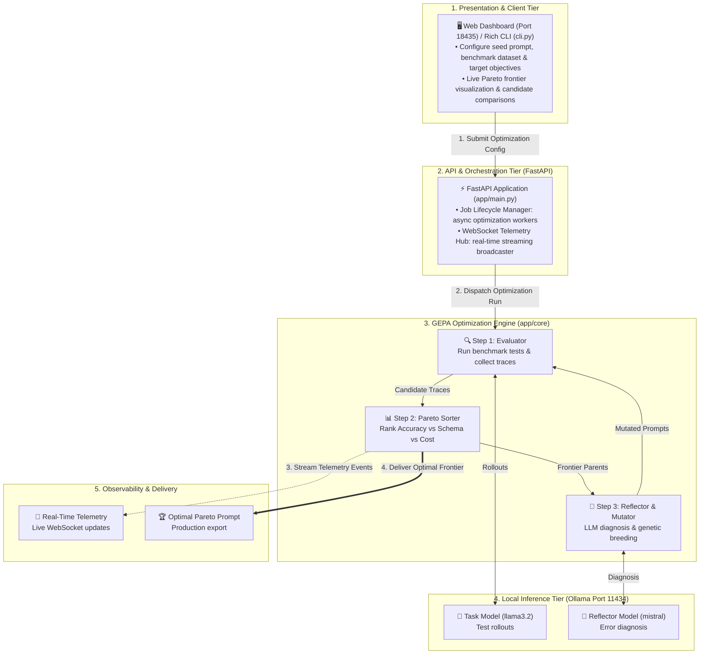
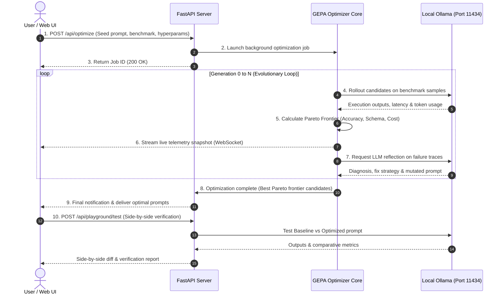
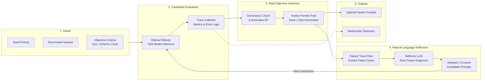

# System Architecture & Technical Specification

## GEPA: Genetic-Pareto Reflective Automatic Prompt Optimizer

This document provides a comprehensive technical reference for the GEPA Prompt Optimization engine, its multi-objective evolutionary loop, LLM reflection mechanisms, and containerized deployment architecture.

---

## 1. High-Level System Architecture & Flow

The GEPA framework is structured into four primary connected tiers, with a dedicated observability and delivery pipeline:

1. **Presentation & Client Tier**: Web Dashboard (Port 18435) and rich terminal CLI (`cli.py`) for configuring optimization targets, monitoring Pareto convergence, and comparing prompts side-by-side.
2. **API & Orchestration Tier**: FastAPI application (`app/main.py`) managing asynchronous background optimization workers and real-time WebSocket telemetry streaming.
3. **Core GEPA Algorithmic Engine**: Evaluator & trace collector (`evaluator.py`), multi-objective Pareto dominance engine (`pareto.py`), and natural language LLM reflector & genetic mutator (`reflector.py`, `genetic_ops.py`).
4. **Local LLM Inference Tier**: Host Ollama instance (Port 11434) running task models (e.g. `llama3.2`) for evaluation rollouts and reflector models (e.g. `mistral`) for failure diagnosis.
5. **Observability & Delivery Tier**: WebSocket event dispatcher delivering live Pareto frontier updates, metric convergence charts, and production-ready optimal prompts.

### High-Level System Connectivity & Evolutionary Flow

### Component Connectivity & Data Flow Summary

| Connection / Link | Source → Target | Protocol / Mechanism | Description |
| :--- | :--- | :--- | :--- |
| **1. Job Submission** | Web UI / CLI → FastAPI | HTTP `POST /api/optimize` | User configures seed prompt, benchmark dataset, and optimization hyper-parameters. |
| **2. Worker Dispatch** | FastAPI → GEPA Core | Async Task Runner | Background thread initializes Population Generation 0 and kicks off the evolutionary loop. |
| **3. Benchmark Rollouts** | Evaluator ↔ Ollama | REST `POST /api/generate` | Local Ollama runs test cases against candidate prompts, recording accuracy, schema validity, and latency. |
| **4. Failure Reflection** | Reflector ↔ Ollama | REST `POST /api/generate` | Reflector LLM diagnoses root-cause error traces and synthesizes targeted instruction fixes. |
| **5. Live Telemetry** | Pareto Sorter → Web UI | WebSocket `/ws` | Streaming events broadcast live frontier coordinates, candidate scores, and diagnostic reflections. |
| **6. Prompt Delivery** | GEPA Core → Web UI | REST / WebSocket / File | Production-ready non-dominated prompt candidate delivered with side-by-side playground testing. |

---

## 2. End-to-End Sequence Diagram

The following sequence diagram illustrates the complete execution flow from when a user clicks "Start GEPA Optimization" to when the final Pareto-optimal prompt is delivered:

---

## 3. Data Flow Diagram (DFD)

The data flow highlights how raw failure critiques are transformed into refined prompt instructions without losing schema validity or token efficiency:

---

## 4. Algorithmic Formulation

### 4.1 Pareto Dominance Formulation
Let $C = \{c_1, c_2, \dots, c_m\}$ be candidate prompts. For each candidate $c$, the evaluator computes an objective vector:
$$\mathbf{F}(c) = \left( f_1(c), f_2(c), \dots, f_k(c) \right)$$
where:
- $f_1(c) \in [0, 1]$: Core Task Accuracy / F1
- $f_2(c) \in [0, 1]$: Strict Schema Compliance (JSON validity, key presence)
- $f_3(c) \in [0, 1]$: Token Efficiency ($1.0 - \text{penalty for verbosity}$)

Candidate $c_a$ **Pareto-dominates** candidate $c_b$ ($c_a \succ c_b$) if and only if:
$$\forall i \in \{1, \dots, k\}, \quad f_i(c_a) \ge f_i(c_b) \quad \land \quad \exists j \in \{1, \dots, k\}, \quad f_j(c_a) > f_j(c_b)$$

The **Pareto Frontier** $\mathcal{P}^*$ is the subset of all candidates not dominated by any other candidate:
$$\mathcal{P}^* = \left\lbrace c \in C \;\middle|\; \nexists c' \in C : c' \succ c \right\rbrace$$

### 4.2 Crowding Distance Diversity Metric
To prevent all prompts from converging to a single point along the trade-off curve, GEPA calculates crowding distance $d_i$ for each solution on the frontier:
$$d_i = \sum_{m=1}^{k} \frac{f_m(i+1) - f_m(i-1)}{f_m^{\max} - f_m^{\min}}$$
Candidates with higher crowding distance are prioritized during parent selection, preserving diverse prompt styles (e.g. ultra-compact vs highly-detailed reasoning).

### 4.3 Natural Language Reflection Formulation
Unlike Reinforcement Learning where feedback is a scalar reward $R \in \mathbb{R}$, GEPA constructs a natural language diagnostic context $\mathcal{D}$:
$$\mathcal{D} = \left\lbrace (x_i, y_i, \hat{y}_i, \mathcal{C}_i) \;\middle|\; \text{trace } i \text{ failed} \right\rbrace$$
where:
- $x_i$: input query
- $y_i$: target ground truth
- $\hat{y}_i$: model output
- $\mathcal{C}_i$: specific failure critique

The Reflector LLM evaluates:
$$(\text{Diagnosis}, \text{Strategy}, c_{\text{new}}) \sim P_{\text{reflector}}\left( \cdot \;\middle|\; \mathcal{D}, c_{\text{parent}}, \text{TaskSpec} \right)$$

---

## 5. Structured Internal Log Taxonomy

The system emits typed telemetry events over WebSockets and stdout:

| Event Type | Description | Key Payload Attributes |
| :--- | :--- | :--- |
| `LOG` | Internal execution logs | `level`, `message`, `details` |
| `SAMPLE_EVALUATED` | Single sample rollout | `candidate_id`, `sample_id`, `passed`, `metrics` |
| `REFLECTION_COMPLETED` | Reflector LLM analysis | `generation`, `parent_id`, `diagnosis`, `strategy`, `mutated_prompt` |
| `CROSSOVER_COMPLETED` | Hybrid prompt synthesis | `generation`, `parent_a`, `parent_b`, `rationale`, `crossed_prompt` |
| `GENERATION_SNAPSHOT` | Frontier state snapshot | `generation`, `frontier_count`, `best_scores`, `frontier_candidates` |
| `OPTIMIZATION_FINISHED` | Final run summary | `duration_seconds`, `frontier_size`, `best_candidate`, `initial_candidate` |
